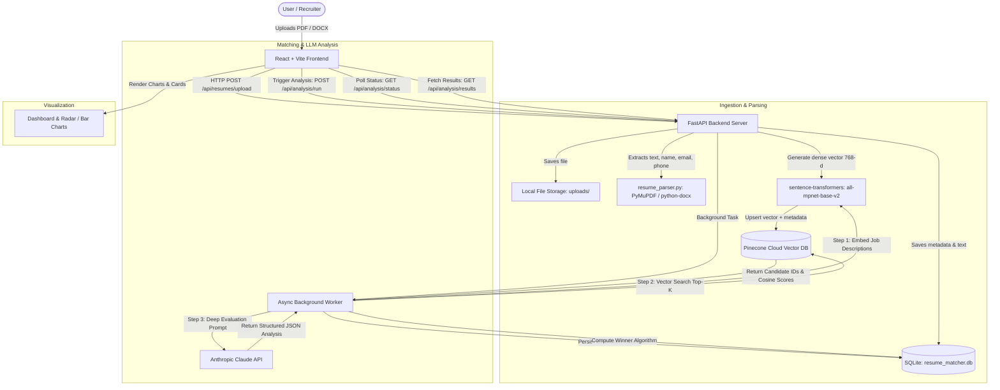

# Resume Matcher AI — Complete A to Z Project Documentation & Architecture Guide

Welcome! If you are completely new to this project, this document provides an exhaustive, beginner-friendly yet technically in-depth guide to **Resume Matcher AI**. It covers what the project is, the problems it solves, the complete tech stack, step-by-step execution workflows, deep-dive code explanations, database schemas, and setup instructions.

---

## Table of Contents
1. [Project Overview & Core Mission](#1-project-overview--core-mission)
2. [High-Level Architecture](#2-high-level-architecture)
3. [Technology Stack (Front to Back)](#3-technology-stack-front-to-back)
4. [How It Works: Step-by-Step A-to-Z Execution Flow](#4-how-it-works-step-by-step-a-to-z-execution-flow)
5. [In-Depth Codebase Walkthrough](#5-in-depth-codebase-walkthrough)
   - [Backend Modules](#backend-modules)
   - [Frontend Modules](#frontend-modules)
6. [Data Storage & Database Schema](#6-data-storage--database-schema)
7. [Vector Search & RAG Pipeline Explained](#7-vector-search--rag-pipeline-explained)
8. [The AI Evaluation & Scoring System](#8-the-ai-evaluation--scoring-system)
9. [Complete REST API Reference](#9-complete-rest-api-reference)
10. [Setup & Running Guide (Windows & Linux/macOS)](#10-setup--running-guide-windows--linuxmacos)
11. [Architectural Highlights, Trade-offs & Future Improvements](#11-architectural-highlights-trade-offs--future-improvements)

---

## 1. Project Overview & Core Mission

### What is Resume Matcher AI?
**Resume Matcher AI** is a full-stack, AI-powered recruitment intelligence platform designed to automate and elevate candidate evaluation. Instead of recruiters manually screening hundreds of resumes against job openings, this system:
1. **Parses** uploaded resumes in PDF and DOCX formats.
2. **Extracts** candidate contact information and raw text.
3. **Embeds** resumes into high-dimensional vector space using a local Transformer model.
4. **Indexes** and performs semantic similarity search with a vector database (**Pinecone**).
5. **Performs Deep LLM Reasoning** (**Anthropic Claude 3.5 Sonnet / 4.6**) to analyze skill match percentages, identify missing requirements, detect grammatical/formatting issues, highlight strengths, and formulate actionable recommendations.
6. **Ranks Candidates** and calculates an **"Overall Winner"** across all job descriptions using a weighted multi-factor scoring formula.
7. **Presents Insights** via an interactive, modern dark-themed web dashboard with radar and bar charts.

---

## 2. High-Level Architecture

The platform uses a **Two-Stage Hybrid Evaluation Architecture**:
* **Stage 1: Fast Vector Retrieval (RAG / Semantic Search)** — Using `all-mpnet-base-v2` (768 dimensions) and Pinecone, the system narrows down the candidate pool to the top-K candidates per job description in milliseconds.
* **Stage 2: Deep LLM Reasoning (Cognitive Analysis)** — Claude analyzes the shortlisted candidates to evaluate nuances, soft/hard skills, context, grammar, and hiring recommendations that pure keyword or vector matching cannot capture.



---

## 3. Technology Stack (Front to Back)

| Layer | Technology | Version | Purpose |
| :--- | :--- | :--- | :--- |
| **Backend Framework** | **FastAPI** | `0.111.0` | High-performance, async Python web API framework |
| **ASGI Server** | **Uvicorn** | `0.29.0` | Asynchronous web server running FastAPI |
| **Database ORM** | **SQLAlchemy** (Async) + **aiosqlite** | `2.0.30` / `0.20.0` | Asynchronous relational data persistence for resumes and evaluations |
| **Relational DB** | **SQLite** | 3.x | Local zero-configuration relational database (`resume_matcher.db`) |
| **Vector Database** | **Pinecone** | `4.1.0` | Managed cloud vector database for fast cosine similarity search |
| **Embedding Model** | **SentenceTransformers** (`all-mpnet-base-v2`) | `3.0.1` | Local 768-dimensional sentence embedding (runs on CPU/GPU, zero API cost) |
| **Large Language Model** | **Anthropic Claude** (`claude-sonnet-4-6`) | `0.28.0` | Deep cognitive analysis, skill gap detection, grammar audit, and hiring advice |
| **PDF Extraction** | **PyMuPDF** (`fitz`) | `1.24.3` | High-speed PDF text and layout extraction |
| **DOCX Extraction** | **python-docx** | `1.1.2` | Microsoft Word document parser (paragraphs and tables) |
| **Configuration & Validation** | **Pydantic** & **pydantic-settings** | `2.7.1` / `2.2.1` | Type validation and `.env` environment loading |
| **Async File I/O** | **aiofiles** | `23.2.1` | Asynchronous file handling without blocking the event loop |
| **Frontend Framework** | **React** with **TypeScript** | `18.3.1` / `5.4.5` | Component-based, strongly-typed frontend interface |
| **Build Tool & Bundler** | **Vite** | `5.3.1` | Blazing-fast development server and optimized build bundling |
| **Styling** | **Tailwind CSS** | `3.4.4` | Utility-first responsive CSS styling with custom dark theme tokens |
| **Routing** | **React Router DOM** | `6.23.1` | Client-side routing for multi-page SPA navigation |
| **Data Visualization** | **Recharts** | `2.12.7` | Responsive SVG charts (RadarChart for skill distribution, BarChart for scores) |
| **File Drag & Drop** | **react-dropzone** | `14.2.3` | Drag-and-drop zone for bulk resume uploads |
| **User Notifications** | **react-hot-toast** | `2.4.1` | Animated toast notifications for status updates and polling progress |
| **Icons** | **Lucide React** | `0.395.0` | Modern, clean iconography |

---

## 4. How It Works: Step-by-Step A-to-Z Execution Flow

### Step 1: File Ingestion & Parsing
1. The user drags and drops one or multiple files (`.pdf`, `.docx`, `.doc`) into the **Upload Page**.
2. Files are transmitted as `multipart/form-data` to `POST /api/resumes/upload`.
3. The server generates a unique UUID filename (e.g., `4a59f...pdf`) and saves the file in `backend/uploads/`.
4. `resume_parser.py` parses the document:
   - For PDF: PyMuPDF opens the document page by page and extracts UTF-8 text.
   - For DOCX: `python-docx` loops over paragraphs and table cells.
   - Cleans up excessive whitespace, carriage returns, and non-printable characters.
   - Heuristically extracts Candidate Name (first valid alpha-line within first 5 lines), Email (regex pattern), and Phone number (Indian/US phone regex patterns).

### Step 2: Database Storage & Vector Indexing
1. The parsed resume is stored in SQLite table `resumes`.
2. The local `all-mpnet-base-v2` transformer encodes the raw resume text into a normalized 768-float embedding vector.
3. The embedding is upserted into Pinecone with:
   - Vector ID: `resume_{id}`
   - Namespace: `resumes`
   - Metadata: `resume_id`, `candidate_name`, `email`, `original_name`.

### Step 3: Triggering AI Analysis
1. The user clicks **"Run AI Analysis"** on the upload screen.
2. The frontend triggers `POST /api/analysis/run`.
3. The backend returns immediately with `{"message": "Analysis started"}` and spawns `_run_full_analysis_bg` as a FastAPI `BackgroundTask`.
4. The frontend begins polling `GET /api/analysis/status` every 3 seconds to show real-time progress (`Analyzing John Doe for Backend Software Engineer (3/10)...`).

### Step 4: Hybrid RAG Search & LLM Reasoning
For every Job Description defined in `job_descriptions.py`:
1. The system creates a consolidated text string representing the role (title, required skills, preferred skills, experience, education, description).
2. The JD text is encoded by the embedding model.
3. Pinecone queries the `resumes` namespace for the **Top 5 most similar resumes** using cosine distance.
4. For each matched candidate, the full resume text and the full JD are sent to **Anthropic Claude** with a strict JSON system prompt.
5. Claude evaluates:
   - `match_score` (0 to 100 integer)
   - `matching_skills` vs `missing_skills`
   - `grammar_issues` (each with description, severity `low/medium/high`, and suggestion)
   - `strengths`, `weaknesses`, and `recommendations`
   - `hire_recommendation` (`strong_yes`, `yes`, `maybe`, `no`)
6. The analysis is saved into SQLite table `analysis_results`.

### Step 5: Winner Calculation Algorithm
The algorithm identifies the candidate with the highest overall cross-role suitability:
$$\text{Rank Weight} = \frac{6 - \text{Rank}}{5} \quad (\text{Rank 1} = 1.0, \text{Rank 2} = 0.8, \dots, \text{Rank 5} = 0.2)$$
$$\text{Weighted Score} = \sum (\text{match\_score} \times \text{Rank Weight})$$
The candidate with the highest combined weighted score and top-5 appearance count is crowned the **Overall Winner**.

### Step 6: Visual Presentation on Dashboard
1. The **Dashboard Page** queries `GET /api/analysis/results` and `GET /api/analysis/winner`.
2. The **Winner Card** displays the winning candidate's name, ID, average match score, appearances, and a **Radar Chart** of performance across job roles.
3. An **Overview Bar Chart** displays top scores across job roles.
4. A **Job Selector Sidebar** allows switching between jobs to view ranked candidate cards with expandable skill pills, strengths, grammar issues, and AI recommendations.

---

## 5. In-Depth Codebase Walkthrough

### Backend Modules (`backend/`)

#### 1. `config.py` — Settings & Environment Management
- Uses `pydantic_settings.BaseSettings` to read environment variables from `.env`.
- Required keys: `anthropic_api_key`, `pinecone_api_key`.
- Defaults provided for `pinecone_index_name` (`"resume-matcher"`), `pinecone_environment` (`"us-east-1"`), `upload_dir` (`"uploads"`), and `database_url` (`"sqlite+aiosqlite:///./resume_matcher.db"`).

#### 2. `database.py` — SQLAlchemy Async Models & Sessions
- Creates an async SQLAlchemy engine with `sqlite+aiosqlite`.
- Defines two models:
  - `Resume`: Stores candidate metadata, parsed text, upload timestamp, and analysis status flag.
  - `AnalysisResult`: Stores job ID, job title, match score, vector score, JSON stringified skill lists, grammar issues, strengths, recommendations, and text summary.
- Provides `init_db()` (creates tables on app startup) and `get_db()` dependency for FastAPI route injection.

#### 3. `resume_parser.py` — Document Extraction & Heuristic Parsing
- `parse_resume(file_path)`: Inspects file extension and routes to `_extract_pdf_text` or `_extract_docx_text`.
- Text sanitizer cleans repeated newlines, multiple spaces, and non-ASCII artifacts.
- Extracts name by inspecting the first 5 lines for short alphabetical phrases.
- Extracts email and phone using compiled regular expressions.

#### 4. `rag_pipeline.py` — SentenceTransformer & Pinecone Integration
- **Model Loading**: Caches `SentenceTransformer("all-mpnet-base-v2")` with `@lru_cache(maxsize=1)`.
- **Pinecone Lifecycle**: Connects to Pinecone client; if index does not exist, provisions a serverless index with 768 dimensions and cosine metric.
- `upsert_resume(resume_id, resume_text, metadata)`: Encodes resume and uploads vector.
- `delete_resume(resume_id)`: Removes vector by ID when a resume is deleted.
- `query_top_resumes_for_job(job_text, top_k=5)`: Encodes JD and queries the `resumes` namespace for nearest neighbors.
- `match_all_jobs_to_resumes(top_k=5)`: Runs top-K query for all configured jobs.

#### 5. `analyzer.py` — LLM Prompting & Winner Calculation
- `analyze_resume_for_job(...)`: Builds a prompt instructing Claude to evaluate the candidate against the role and return pure JSON.
- Cleans markdown code fences (` ```json `) and deserializes the response.
- Includes `_fallback_analysis` to gracefully handle any unexpected LLM JSON decoding failure.
- `compute_winner(results_by_jd)`: Iterates through job matches, applies rank weights, computes average scores, and finds the top candidate.

#### 6. `job_descriptions.py` — Job Data Store
- Contains predefined job description dictionaries (e.g., Backend Software Engineer, Frontend Software Engineer) with required skills, preferred skills, experience, education, and full description.
- Provides helper `get_job_text(job)` to format a clean text string for vector embedding.

#### 7. `main.py` — FastAPI REST API & Background Orchestration
- Configures CORS for `localhost:3000` and `localhost:5173`.
- Serves endpoints for upload, resume listing, resume deletion, job listing, background analysis triggering, status polling, and stats.
- Offloads blocking AI and vector operations to a thread pool using `asyncio.to_thread()` so the async event loop stays completely responsive.

---

### Frontend Modules (`frontend/src/`)

#### 1. `App.tsx` — Navigation & Routing
- Sets up client-side routing via `react-router-dom`:
  - `/` $\rightarrow$ `UploadPage`
  - `/dashboard` $\rightarrow$ `DashboardPage`
  - `/jobs` $\rightarrow$ `JobsPage`
- Provides top navigation bar and global toast container (`react-hot-toast`).

#### 2. `pages/UploadPage.tsx` — Uploads & Job Launch
- Implements `useDropzone` for drag-and-drop file ingestion.
- Displays summary statistics (Total Resumes, Analyzed, Jobs, Pinecone count).
- Shows upload queue and a table of uploaded resumes with delete buttons.
- Triggers AI Analysis and handles continuous status polling.

#### 3. `pages/DashboardPage.tsx` — Results & Analytics
- Renders the **Overall Winner Card** with average score, top-5 hit counts, and a Recharts **Radar Chart**.
- Renders a **Bar Chart** showing highest candidate score across all jobs.
- Includes a two-column layout: Job list on the left, candidate rank list on the right.
- `ResumeCard` expands to reveal matched skills (green badges), missing skills (red badges), strengths, actionable recommendations, and grammar warnings color-coded by severity.

#### 4. `pages/JobsPage.tsx` — Job Directory
- Search input allowing search by job title, company name, or specific skills.
- Accordion cards that expand to display required skills, preferred skills, location, experience requirements, and full job descriptions.

#### 5. `api/client.ts` — Axios HTTP Client
- Configured with `baseURL: "/api"` (proxied by Vite to `http://localhost:8000`).
- Encapsulates typed methods: `resumeApi`, `analysisApi`, `jobsApi`, `statsApi`.

#### 6. `types/index.ts` — TypeScript Type Definitions
- Type contracts matching the backend schemas (`Resume`, `AnalysisEntry`, `GrammarIssue`, `Winner`, `Job`, `Stats`).

---

## 6. Data Storage & Database Schema

### SQLite Relational Schema

```sql
-- Resumes Table
CREATE TABLE resumes (
    id INTEGER PRIMARY KEY AUTOINCREMENT,
    filename VARCHAR(255) NOT NULL,
    original_name VARCHAR(255) NOT NULL,
    file_path VARCHAR(500) NOT NULL,
    raw_text TEXT NOT NULL,
    candidate_name VARCHAR(255) DEFAULT 'Unknown',
    email VARCHAR(255) DEFAULT '',
    phone VARCHAR(50) DEFAULT '',
    uploaded_at DATETIME DEFAULT CURRENT_TIMESTAMP,
    is_analyzed BOOLEAN DEFAULT 0
);

-- Analysis Results Table
CREATE TABLE analysis_results (
    id INTEGER PRIMARY KEY AUTOINCREMENT,
    resume_id INTEGER NOT NULL,
    job_id VARCHAR(50) NOT NULL,
    job_title VARCHAR(255) NOT NULL,
    match_score FLOAT NOT NULL,
    vector_score FLOAT NOT NULL,
    matching_skills TEXT NOT NULL,   -- JSON array: ["Python", "FastAPI"]
    missing_skills TEXT NOT NULL,    -- JSON array: ["Docker"]
    grammar_issues TEXT NOT NULL,    -- JSON array of objects: [{"issue":..., "severity":...}]
    strengths TEXT NOT NULL,         -- JSON array: ["Strong API experience"]
    recommendations TEXT NOT NULL,   -- JSON array: ["Add unit tests to projects"]
    summary TEXT NOT NULL,
    created_at DATETIME DEFAULT CURRENT_TIMESTAMP
);
```

### Pinecone Vector Schema
- **Index Name**: `resume-matcher`
- **Metric**: `cosine`
- **Dimension**: `768`
- **Namespace**: `resumes`
- **Vector ID**: `resume_{resume_id}` (e.g., `resume_1`)
- **Metadata**:
  ```json
  {
    "resume_id": 1,
    "candidate_name": "Jane Doe",
    "email": "jane@example.com",
    "original_name": "jane_doe_resume.pdf"
  }
  ```

---

## 7. Vector Search & RAG Pipeline Explained

### Why Embeddings?
Keyword matching fails when a resume says *"Built microservices with ASGI and Python"* while the job description asks for *"FastAPI RESTful web service development"*. 

The `all-mpnet-base-v2` transformer embeds both texts into high-dimensional geometric space where semantically similar concepts cluster together.

### How Cosine Similarity Works in this Project:
$$\text{Cosine Similarity}(\vec{A}, \vec{B}) = \frac{\vec{A} \cdot \vec{B}}{\|\vec{A}\| \|\vec{B}\|}$$
Since embeddings are pre-normalized (`normalize_embeddings=True`), the dot product directly equals the cosine similarity (ranging between -1.0 and +1.0). In this project, scores typically range between 0.40 (low match) and 0.85+ (strong match).

---

## 8. The AI Evaluation & Scoring System

### Claude Prompt Design
The prompt sends both the full resume text and the full job description to `claude-sonnet-4-6`. The prompt instructs the model to act as an expert technical recruiter and output a strict JSON payload:
- **`match_score`**: 0 to 100 holistic score considering requirements, depth, and domain fit.
- **`matching_skills`** & **`missing_skills`**: Precise skill gap analysis.
- **`grammar_issues`**: Audit of spelling, syntax, or phrasing problems with severity tags (`low`, `medium`, `high`).
- **`hire_recommendation`**: `strong_yes`, `yes`, `maybe`, or `no`.

### Winner Calculation Formula
A single candidate might score high on one specific role, but an organization often looks for the strongest overall talent across available openings:
1. Resumes receive a rank from 1 to 5 per job description.
2. Rank weights: Rank 1 = 1.0, Rank 2 = 0.8, Rank 3 = 0.6, Rank 4 = 0.4, Rank 5 = 0.2.
3. Multiplied by the Claude `match_score` to give a position-weighted rating.
4. Candidates with consistent top-tier performance across roles accumulate the highest overall score.

---

## 9. Complete REST API Reference

| Method | Endpoint | Description | Request Body / Params | Response |
| :--- | :--- | :--- | :--- | :--- |
| `GET` | `/api/jobs` | Get all job descriptions | None | `{ "jobs": [...], "total": 2 }` |
| `GET` | `/api/jobs/{id}` | Get specific job description | Path: `id` | Job object |
| `POST` | `/api/resumes/upload` | Upload & index resumes | `multipart/form-data` with `files` | `{ "uploaded": [...], "errors": [...] }` |
| `GET` | `/api/resumes` | List all uploaded resumes | None | `{ "resumes": [...], "total": N }` |
| `DELETE` | `/api/resumes/{id}` | Delete resume from DB & Pinecone | Path: `id` | `{ "message": "Resume deleted..." }` |
| `POST` | `/api/analysis/run` | Launch background analysis | None | `{ "message": "Analysis started", ... }` |
| `GET` | `/api/analysis/status`| Poll analysis progress | None | `{ "running": bool, "progress": str, ... }` |
| `GET` | `/api/analysis/results`| Get all results grouped by job | None | `{ "results": { [jobId]: { ... } } }` |
| `GET` | `/api/analysis/job/{id}`| Top 5 resumes for a job | Path: `id` | `{ "job": {...}, "top_resumes": [...] }` |
| `GET` | `/api/analysis/resume/{id}`| All job analyses for one resume | Path: `id` | `{ "resume": {...}, "job_results": [...] }` |
| `GET` | `/api/analysis/winner` | Compute and fetch overall winner | None | `{ "winner": { ... } }` |
| `GET` | `/api/stats` | Dashboard metric counters | None | `{ "total_resumes": N, ... }` |

---

## 10. Setup & Running Guide (Windows & Linux/macOS)

### Prerequisites
- **Python**: 3.10, 3.11, or 3.12 installed
- **Node.js**: v18+ and npm installed
- **Anthropic API Key**: [Get one from Anthropic](https://console.anthropic.com/)
- **Pinecone API Key**: [Get one from Pinecone](https://www.pinecone.io/)

### Configuration (`backend/.env`)
Create or edit `backend/.env`:
```env
ANTHROPIC_API_KEY=sk-ant-api03-...
PINECONE_API_KEY=pcsk_...
PINECONE_INDEX_NAME=resume-matcher
PINECONE_ENVIRONMENT=us-east-1
UPLOAD_DIR=uploads
DATABASE_URL=sqlite+aiosqlite:///./resume_matcher.db
```

### Running the Project

#### Option A: Running on Windows (PowerShell)

**Terminal 1 — Backend:**
```powershell
cd d:\Projects\resume-matcher\backend

# Create virtual environment (if not already created)
python -m venv venv
.\venv\Scripts\Activate.ps1

# Install dependencies
pip install -r requirements.txt

# Start FastAPI server
uvicorn main:app --reload --port 8000
```
Backend runs at: `http://localhost:8000` (Interactive Swagger Docs: `http://localhost:8000/docs`)

**Terminal 2 — Frontend:**
```powershell
cd d:\Projects\resume-matcher\frontend

# Install dependencies
npm install

# Start Vite dev server
npm run dev
```
Frontend runs at: `http://localhost:3000`

#### Option B: Running on Linux/macOS
You can use the included `start.sh` script:
```bash
chmod +x start.sh
./start.sh
```

---

## 11. Architectural Highlights, Trade-offs & Future Improvements

### Key Design Strengths
1. **Cost & Speed Efficiency (Two-Stage Pipeline)**: Instead of sending every resume to Claude (which would be slow and expensive), the local SentenceTransformers model and Pinecone filter down to the top-5 candidates per job. Only top candidates are evaluated by Claude.
2. **Local Free Embeddings**: `all-mpnet-base-v2` runs locally on the host machine. Embedding generation incurs \$0 API cost.
3. **Non-blocking Concurrency**: Long-running AI analysis runs in a background thread via `asyncio.to_thread()`, keeping FastAPI's event loop fully responsive for status polling.
4. **Rich Visual Feedback**: Interactive radar and bar charts make complex scoring immediately understandable.

### Known Considerations & Future Enhancements
- **Custom Job Creation**: Currently, job descriptions are defined in `job_descriptions.py`. A future enhancement could allow recruiters to create and edit job postings directly from the UI.
- **Distributed Task Queue**: For enterprise-scale processing (thousands of resumes), the in-memory background task status can be migrated to **Celery** or **Redis Queue (RQ)**.
- **LLM Provider Flexibility**: The analyzer can easily be abstracted to support Google Gemini, OpenAI, or local Ollama models alongside Anthropic Claude.
